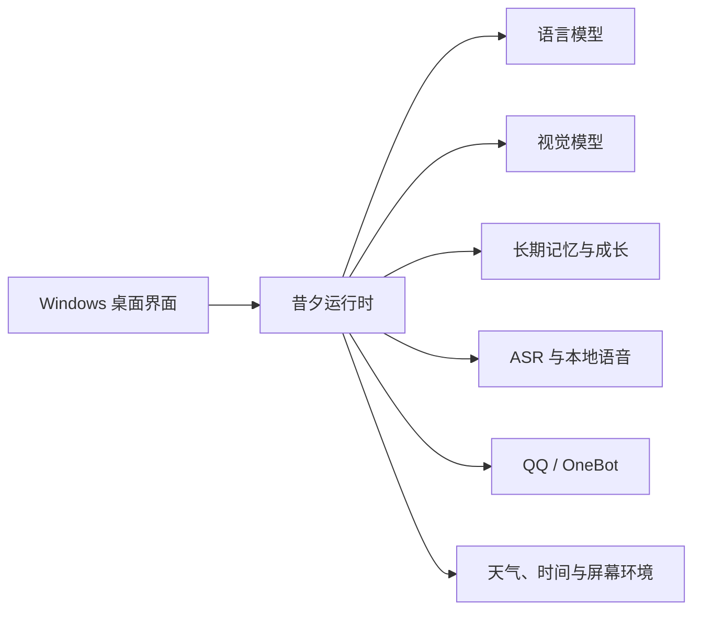

<div align="center">
  
  <h1>昔夕 Xixi</h1>
  <p><strong>面向 Windows 的本地 AI 陪伴应用</strong></p>
  <p>将模型、语音、记忆、QQ 与桌面陪伴整合进一个可配置、可扩展的本地工作台。</p>

  <p>
    <a href="https://github.com/lianhua99520/Xixi/releases/tag/v0.1"></a>
    <a href="./LICENSE"></a>
    
    
  </p>

  <p>
    <a href="https://github.com/lianhua99520/Xixi/releases/tag/v0.1"><strong>下载安装</strong></a>
    · <a href="#核心能力">核心能力</a>
    · <a href="#源码运行">源码运行</a>
    · <a href="https://github.com/lianhua99520/Xixi/issues">问题反馈</a>
  </p>
</div>

> [!IMPORTANT]
> 昔夕 `0.1` 是公开预览版本，核心流程已经可用，但安装适配、性能和跨设备兼容性仍在持续完善。建议先阅读发布说明，并通过 Issues 提交可复现的问题。

## 项目简介

昔夕不是单一的聊天窗口，而是一套运行在 Windows 上的本地 AI 陪伴系统。它将语言模型、视觉模型、语音输入输出、长期记忆、QQ 通讯和环境感知组织成独立模块，并通过统一的桌面界面完成配置与管理。

项目强调三件事：

- **可配置**：语言模型与视觉模型可以使用不同供应商，支持 OpenAI 兼容接口和自定义网关。
- **本地优先**：聊天、记忆、关系数据和运行状态保存在用户自己的电脑中，密钥交由 Windows 凭据管理器保存。
- **可扩展**：语音、QQ、屏幕理解、天气和持续成长均按模块组织，便于替换实现或继续开发。

## 核心能力

| 模块 | 能力 |
| --- | --- |
| 模型接入 | 独立配置语言与视觉模型，支持自定义 API 地址、密钥、模型名称和连接检测 |
| 多模态对话 | 文字聊天、图片理解、联网知识检索和上下文对话 |
| 语音交互 | 中文、日语、英语本地语音回复，麦克风输入、语音识别和完整音频通话 |
| QQ 通讯 | QQ 私聊与群聊、扫码登录、名称或 `@` 唤醒、可控的主动参与 |
| 记忆与成长 | 跨会话长期记忆、重要度管理、兴趣成长、知识学习和自我思考记录 |
| 环境能力 | 时间与天气感知、极端天气提醒、城市配置和设备权限管理 |
| 游戏陪伴 | 在用户主动开启后观察游戏画面，并提供鼓励、吐槽和建议，不控制键盘或鼠标 |
| 桌面管理 | 首次启动配置中心、组件检测、按需安装、下载进度和本地运行状态管理 |

## 系统结构



各模块通过统一运行时协调。关闭桌面应用后，受管理的后端与子进程会一起退出；公开版数据与程序文件分开保存，覆盖升级时保留用户数据。

## 下载与安装

### Windows 安装包

1. 前往 [昔夕 0.1 发布页面](https://github.com/lianhua99520/Xixi/releases/tag/v0.1)。
2. 下载并运行 `Xixi-Setup.exe`；这是普通用户唯一需要下载的安装文件。
3. 如需核对文件完整性，可选下载 `SHA256SUMS.txt` 并校验安装包 SHA-256。
4. 选择安装位置，并在首次启动配置中心完成基础环境检查。
5. 语言模型和视觉模型可以暂时跳过，之后在“设置 > 模型与 API”中配置。
6. QQ、语音识别和本地语音组件可在“设置 > 环境配置”中按需安装。

支持 **Windows 10/11 x64**。本地语音和语音识别组件体积较大，首次下载、安装或加载需要一定时间。

### 麦克风权限

首次使用语音输入、语音通话或游戏陪伴通话时，昔夕会请求麦克风权限。如果曾选择拒绝，可前往“设置 > 基础与启动 > 设备权限”重新授权、检测设备或打开 Windows 麦克风设置。

## 模型配置

语言模型和视觉模型拥有相互独立的连接配置：

- API 地址
- API 密钥
- 模型名称
- 接口检测结果

API 密钥保存在当前 Windows 用户的凭据管理器中，不写入公开配置文件。请勿在 Issue、日志或截图中提交真实密钥。

## 数据与隐私

公开安装包不会包含维护者的聊天记录、记忆、QQ 登录状态、API 密钥、天气城市、模型供应商配置、浏览器缓存或日志。

运行后产生的数据保存在安装位置对应的用户数据目录中。覆盖安装和版本升级会保留该目录；卸载时由用户决定是否同时删除数据。

- [隐私与本地数据](docs/PRIVACY.md)
- [故障排查](docs/TROUBLESHOOTING.md)
- [开源授权边界](docs/LICENSING.md)

## 源码运行

### 开发环境

- Windows 10/11 x64
- Python 3.12
- Node.js 22，用于前端语法检查
- PowerShell 7，构建公开安装包时使用

```powershell
git clone https://github.com/lianhua99520/Xixi.git
cd Xixi
py -3.12 -m venv venv
.\venv\Scripts\python.exe -m pip install --upgrade pip
.\venv\Scripts\python.exe -m pip install -r requirements-dev.txt
.\venv\Scripts\python.exe start_xixi_desktop.py
```

公开源码不包含私人训练模型、参考音频、用户数据、下载后的第三方运行时或构建产物。缺少可选本地组件时，可以在应用环境配置中安装，或使用自己拥有授权的资源进行开发。

### 质量检查

```powershell
.\venv\Scripts\python.exe scripts\audit_repository.py
.\venv\Scripts\python.exe -m unittest discover -s tests -p "test_*.py"
node --check studio\app.js
node --check studio\setup.js
node --check studio\call_overlay.js
```

CI 会在 Windows 环境中执行仓库隐私审计、Python 编译检查、完整单元测试和 JavaScript 语法检查。

## 项目结构

```text
app/                 核心运行时、模型、QQ、记忆、语音和环境服务
studio/              桌面界面与通话悬浮窗
tests/               自动化测试
scripts/             审计、验证、冒烟测试和发布工具
packaging/           Windows 公开版构建与安装程序配置
docs/                隐私、授权、排障和发布文档
```

## 参与贡献

欢迎提交问题报告、文档改进和代码贡献。开始之前请阅读 [参与贡献](CONTRIBUTING.md)：

- 不要提交 API 密钥、QQ 信息、聊天记录、个人路径或日志。
- 不要提交没有明确再分发许可的模型、音频、角色美术、数据集或第三方代码。
- 行为变化应附带相应测试，并说明复现方式与验证结果。

## 开源组件与致谢

昔夕建立在 GPT-SoVITS、faster-whisper、NapCatQQ、OneBot、Ollama、pywebview、OpenAI Python SDK、OpenCV、FFmpeg、Lucide 等项目之上。主要项目、用途、源码链接和许可边界见 [第三方组件与致谢](THIRD_PARTY_NOTICES.md)；完整依赖清单可在下方展开。

<details>
<summary><strong>查看完整第三方组件与依赖清单</strong></summary>

下面的清单覆盖昔夕源码直接调用、公开安装包直接携带、环境配置直接下载，以及构建发布流程直接使用的第三方项目。操作系统自带组件不重复列出；第三方项目继续递归使用的依赖以其包内元数据和许可证文件为准。

### 应用运行依赖

| 项目 | 在昔夕中的用途 | 声明 |
| --- | --- | --- |
| [OpenAI Python SDK](https://github.com/openai/openai-python) | OpenAI 及兼容网关的模型调用 | Apache-2.0 |
| [Ollama Python](https://github.com/ollama/ollama-python) | 本地 Ollama 模型客户端 | MIT |
| [HTTPX](https://github.com/encode/httpx) | 模型、天气、搜索、下载和 QQ HTTP 请求 | BSD-3-Clause |
| [websockets](https://github.com/python-websockets/websockets) | OneBot 与 QQ 实时消息连接 | BSD-3-Clause |
| [keyring](https://github.com/jaraco/keyring) | Windows 凭据管理器中的 API 密钥保存 | MIT |
| [pywebview](https://github.com/r0x0r/pywebview) | Windows 桌面窗口与 WebView2 桥接 | BSD-3-Clause |
| [SQLite](https://www.sqlite.org/) | 聊天记录、长期记忆、状态与成长数据存储 | Public Domain |
| [Pillow](https://github.com/python-pillow/Pillow) | 图片、头像、二维码和安装器图像处理 | MIT-CMU |
| [python-qrcode](https://github.com/lincolnloop/python-qrcode) | QQ 登录二维码渲染 | BSD |
| [pystray](https://github.com/moses-palmer/pystray) | Windows 系统托盘 | LGPLv3 |
| [NumPy](https://github.com/numpy/numpy) | 音频、图像与数值处理 | 按发行包内许可证使用 |
| [python-sounddevice](https://github.com/spatialaudio/python-sounddevice) | 麦克风录音与 PortAudio 接入 | MIT |
| [pynput](https://github.com/moses-palmer/pynput) | 全局热键监听 | LGPLv3 |
| [MSS](https://github.com/BoboTiG/python-mss) | 通用屏幕截图 | MIT |
| [DXcam](https://github.com/ra1nty/DXcam) | Windows Desktop Duplication 高速画面捕获 | MIT |
| [comtypes](https://github.com/enthought/comtypes) | Windows COM 与 DXCam 支持 | MIT |
| [opencv-python](https://github.com/opencv/opencv-python) | 游戏画面、变化检测与本地图像分析 | Apache-2.0 |
| [imageio-ffmpeg](https://github.com/imageio/imageio-ffmpeg) | 内置 FFmpeg 获取与音频拼接 | BSD-2-Clause |
| [pypinyin](https://github.com/mozillazg/python-pinyin) | 中文拼音、谐音与语音文本处理 | MIT |
| [OpenCC Python](https://github.com/yichen0831/opencc-python) (`opencc-python-reimplemented`) | 中文文本标准化 | Apache License |
| [edge-tts](https://github.com/rany2/edge-tts) | 可选的系统语音兼容能力 | 按原项目许可证使用 |
| [Lucide](https://github.com/lucide-icons/lucide) | 应用界面图标 | ISC |

### 可选组件、模型与数据

| 项目 | 在昔夕中的用途 | 声明 |
| --- | --- | --- |
| [GPT-SoVITS](https://github.com/RVC-Boss/GPT-SoVITS) | 中文、日语与英语本地语音合成引擎 | MIT License |
| [faster-whisper](https://github.com/SYSTRAN/faster-whisper) | 本地语音识别与通话转写 | MIT |
| [CTranslate2](https://github.com/OpenNMT/CTranslate2) | Whisper 高性能推理运行时 | MIT |
| [Hugging Face Hub](https://github.com/huggingface/huggingface_hub) | 模型文件获取与缓存 | Apache-2.0 |
| [Pygame](https://github.com/pygame/pygame) | 完整音频播放 | LGPL |
| [FFmpeg](https://ffmpeg.org/) | 音频转码、预处理与片段合并 | 按 FFmpeg 构建所含许可证使用 |
| [NapCatQQ](https://github.com/NapNeko/NapCatQQ) | QQ 登录、私聊、群聊与 OneBot 通讯 | NapCatQQ License，捆绑再分发仅限非商业用途 |
| [OneBot 11](https://github.com/botuniverse/onebot-11) | QQ 消息接口协议 | 按原项目许可证使用 |
| [Ollama](https://github.com/ollama/ollama) | 可选的本地语言与视觉模型运行环境 | MIT |
| `qwen2.5vl:3b` | 默认可选的本地视觉模型 | 模型许可证归模型发布者所有 |
| `Systran/faster-whisper-small` | 默认本地语音识别模型 | 模型许可证归模型发布者所有 |
| GPT-SoVITS 基础模型 | `s1v3`、Chinese RoBERTa、Chinese HuBERT 与 ERes2Net 说话人模型 | 各模型按原发布许可证使用 |
| G2PWModel | 中文多音字与字音预测 | 模型及数据按原项目许可证使用 |
| fastText `lid.176.bin` | 语种识别 | 模型许可证归原发布者所有 |
| [NLTK Data](https://github.com/nltk/nltk_data) | CMU 发音词典与英语词性标注数据 | 各数据包按自身许可证使用 |
| [pyopenjtalk-plus](https://github.com/tsukumijima/pyopenjtalk-plus) | 日语文本转音素 | 按原项目许可证使用 |
| [Microsoft Edge WebView2](https://developer.microsoft.com/microsoft-edge/webview2/) | 桌面界面渲染运行时 | Microsoft 软件许可条款 |
| [uv](https://github.com/astral-sh/uv) | 环境配置中的高速 Python 包安装器 | Apache-2.0 / MIT |
| NVIDIA CUDA 12.1 相关运行库 | GPT-SoVITS、PyTorch、ONNX Runtime 与 CTranslate2 的可选 GPU 加速 | NVIDIA 软件许可条款 |

<details>
<summary><strong>昔夕本地语音系统使用的 Python 依赖</strong></summary>

以下项目来自当前 GPT-SoVITS Windows 安装清单，环境配置会在独立的 Python 3.10 语音环境中安装：

`pip`、`setuptools`、`wheel`、`torch`、`torchaudio`、`numpy`、`scipy`、`tensorboard`、`librosa`、`numba`、`pytorch-lightning`、`gradio`、`ffmpeg-python`、`onnxruntime-gpu`、`tqdm`、`funasr`、`cn2an`、`pypinyin`、`pyopenjtalk-plus`、`g2p_en`、`modelscope`、`sentencepiece`、`transformers`、`peft`、`chardet`、`PyYAML`、`psutil`、`jieba`、`split-lang`、`fast_langdetect`、`wordsegment`、`rotary_embedding_torch`、`ToJyutping`、`g2pk2`、`ko_pron`、`opencc`、`fastapi`、`x_transformers`、`torchmetrics`、`pydantic`、`ctranslate2` 与 `av`。

训练音色、参考音频和昔夕专用模型不属于 Apache-2.0 代码授权范围，也不会因源码公开而获得再训练或再分发许可。

</details>

<details>
<summary><strong>NapCatQQ 随包携带的 Node.js 与原生依赖</strong></summary>

NapCatQQ 直接使用 `express` 与 `ws`，并随包携带以下 Node.js 模块：

`accepts`、`body-parser`、`bytes`、`call-bind-apply-helpers`、`call-bound`、`content-disposition`、`content-type`、`cookie`、`cookie-signature`、`debug`、`depd`、`dunder-proto`、`ee-first`、`encodeurl`、`es-define-property`、`es-errors`、`es-object-atoms`、`escape-html`、`etag`、`finalhandler`、`forwarded`、`fresh`、`function-bind`、`get-intrinsic`、`get-proto`、`gopd`、`has-symbols`、`hasown`、`http-errors`、`iconv-lite`、`inherits`、`ipaddr.js`、`is-promise`、`math-intrinsics`、`media-typer`、`merge-descriptors`、`mime-db`、`mime-types`、`ms`、`negotiator`、`object-inspect`、`on-finished`、`once`、`parseurl`、`path-to-regexp`、`proxy-addr`、`qs`、`range-parser`、`raw-body`、`router`、`safer-buffer`、`send`、`serve-static`、`setprototypeof`、`side-channel`、`side-channel-list`、`side-channel-map`、`side-channel-weakmap`、`statuses`、`toidentifier`、`type-is`、`unpipe`、`vary` 与 `wrappy`。

安装包还包含 NapCatQQ 提供的 DPAPI、FFmpeg、NAPI、网络数据包、ConPTY 与 WinPTY 原生模块。它们均属于 NapCatQQ 分发内容，并继续遵守 NapCatQQ 及各自上游许可证。

</details>

### 联网服务与下载来源

| 服务 | 用途 |
| --- | --- |
| 用户配置的 OpenAI 兼容、OpenAI Responses、Anthropic、Gemini 或 Ollama 接口 | 语言模型与视觉模型推理 |
| DuckDuckGo HTML / Lite、Microsoft Bing | 联网知识搜索与结果交叉验证 |
| [Open-Meteo](https://open-meteo.com/) | 城市解析、当前天气、预报与极端天气判断 |
| GitHub、GitHub API、Raw 与 Codeload | 源码、NapCatQQ、GPT-SoVITS 和 Ollama 发布文件获取 |
| [ModelScope 魔搭](https://modelscope.cn/) | 默认优先的模型与组件下载渠道 |
| Hugging Face 与 `hf-mirror.com` | Whisper、GPT-SoVITS 基础模型与备用下载 |
| 南京大学 PyPI / PyTorch 镜像 | 本地语音 Python 与 CUDA 依赖下载 |
| PyPI 与 PyTorch 官方下载站 | Python 和 PyTorch 备用下载 |
| `ghfast.top`、`gh-proxy.com`、`ghproxy.net` | GitHub 文件下载备用代理 |
| [Shields.io](https://shields.io/) | README 版本、平台与许可证徽章 |
| Windows Package Manager `winget` | Ollama 安装失败时的系统级备用安装方式 |
| 腾讯 QQ | QQ 账号登录与消息传输 |

### 开发与发布工具

| 工具 | 用途 |
| --- | --- |
| Python 3.12 | 昔夕主程序开发、测试与运行 |
| Python 3.10 | GPT-SoVITS 独立语音环境 |
| Git | 版本控制 |
| Node.js 22 | 前端 JavaScript 语法检查 |
| PowerShell 7 | Windows 公开版构建脚本 |
| [PyInstaller](https://github.com/pyinstaller/pyinstaller) | Python 桌面程序冻结与打包 |
| [Inno Setup 6](https://jrsoftware.org/isinfo.php) | Windows 安装程序生成 |
| [Playwright](https://github.com/microsoft/playwright) | 桌面界面自动化与视觉检查 |
| [Mermaid](https://github.com/mermaid-js/mermaid) | README 系统结构图 |
| GitHub Actions、`actions/checkout`、`actions/setup-python`、`actions/setup-node` | 持续集成与公开仓库检查 |

各组件的版权与许可证归原作者所有；昔夕对这些项目的使用不代表相关项目、服务或维护者为昔夕提供背书。关键组件的第三方声明、随项目提供的许可证文本和再分发限制见 [第三方声明](THIRD_PARTY_NOTICES.md) 与 [`third_party_licenses/`](third_party_licenses/)。若发现署名、依赖或授权信息需要补充，欢迎通过 [Issues](https://github.com/lianhua99520/Xixi/issues) 提醒维护者。

</details>

## 开源许可

昔夕的原创软件源代码以 [Apache License 2.0](LICENSE) 开源。

角色图像、应用图标、训练音色、模型权重、参考音频、训练数据、名称与标识不属于 Apache-2.0 的代码授权范围。第三方组件继续遵守各自许可证，其中 NapCatQQ 的捆绑再分发仅限非商业用途。

详细信息见 [NOTICE](NOTICE)、[开源授权边界](docs/LICENSING.md) 和 [第三方声明](THIRD_PARTY_NOTICES.md)。
