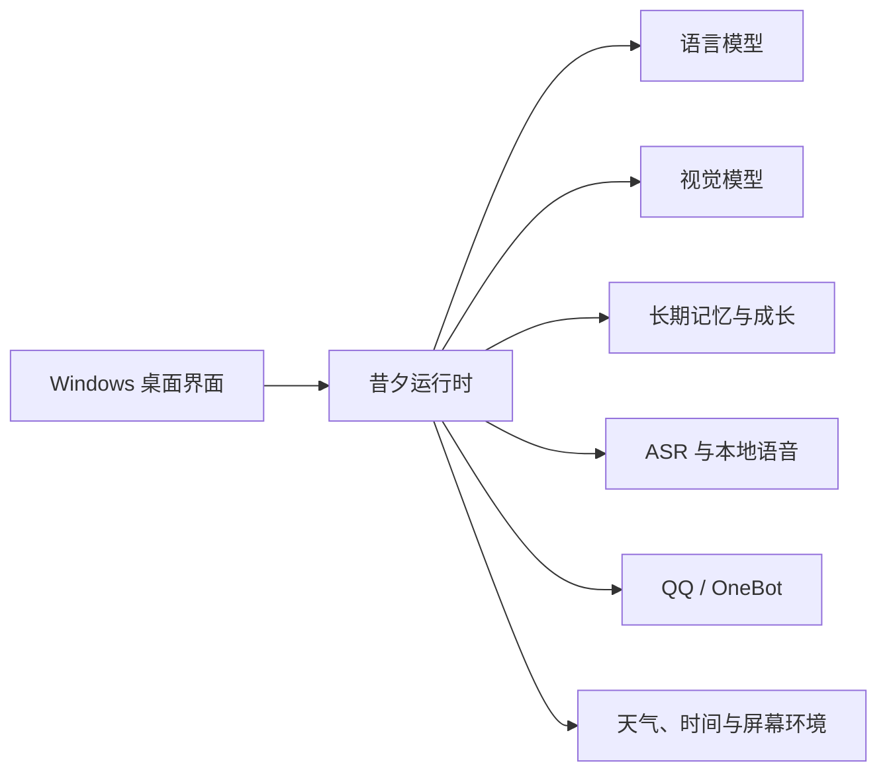

<div align="center">
  
  <h1>昔夕 Xixi</h1>
  <p><strong>面向 Windows 的本地 AI 陪伴应用</strong></p>
  <p>将模型、语音、记忆、QQ 与桌面陪伴整合进一个可配置、可扩展的本地工作台。</p>

  <p>
    <a href="https://github.com/cc15923921606-web/Xixi/releases/tag/v0.1"></a>
    <a href="https://github.com/cc15923921606-web/Xixi/actions/workflows/ci.yml"></a>
    <a href="./LICENSE"></a>
    
    
  </p>

  <p>
    <a href="https://github.com/cc15923921606-web/Xixi/releases/tag/v0.1"><strong>下载安装</strong></a>
    · <a href="#核心能力">核心能力</a>
    · <a href="#源码运行">源码运行</a>
    · <a href="https://github.com/cc15923921606-web/Xixi/issues">问题反馈</a>
  </p>
</div>

> [!IMPORTANT]
> 昔夕 `0.1` 是公开预览版本，核心流程已经可用，但安装适配、性能和跨设备兼容性仍在持续完善。建议先阅读发布说明，并通过 Issues 提交可复现的问题。

## 项目简介

昔夕不是单一的聊天窗口，而是一套运行在 Windows 上的本地 AI 陪伴系统。它将语言模型、视觉模型、语音输入输出、长期记忆、QQ 通讯和环境感知组织成独立模块，并通过统一的桌面界面完成配置与管理。

项目强调三件事：

- **可配置**：语言模型与视觉模型可以使用不同供应商，支持 OpenAI 兼容接口和自定义网关。
- **本地优先**：聊天、记忆、关系数据和运行状态保存在用户自己的电脑中，密钥交由 Windows 凭据管理器保存。
- **可扩展**：语音、QQ、屏幕理解、天气和持续成长均按模块组织，便于替换实现或继续开发。

## 核心能力

| 模块 | 能力 |
| --- | --- |
| 模型接入 | 独立配置语言与视觉模型，支持自定义 API 地址、密钥、模型名称和连接检测 |
| 多模态对话 | 文字聊天、图片理解、联网知识检索和上下文对话 |
| 语音交互 | 中文、日语、英语本地语音回复，麦克风输入、语音识别和完整音频通话 |
| QQ 通讯 | QQ 私聊与群聊、扫码登录、名称或 `@` 唤醒、可控的主动参与 |
| 记忆与成长 | 跨会话长期记忆、重要度管理、兴趣成长、知识学习和自我思考记录 |
| 环境能力 | 时间与天气感知、极端天气提醒、城市配置和设备权限管理 |
| 游戏陪伴 | 在用户主动开启后观察游戏画面，并提供鼓励、吐槽和建议，不控制键盘或鼠标 |
| 桌面管理 | 首次启动配置中心、组件检测、按需安装、下载进度和本地运行状态管理 |

## 系统结构



各模块通过统一运行时协调。关闭桌面应用后，受管理的后端与子进程会一起退出；公开版数据与程序文件分开保存，覆盖升级时保留用户数据。

## 下载与安装

### Windows 安装包

1. 前往 [昔夕 0.1 发布页面](https://github.com/cc15923921606-web/Xixi/releases/tag/v0.1)。
2. 下载 `Xixi-Setup.exe` 和 `SHA256SUMS.txt`。
3. 校验安装包 SHA-256 后运行安装程序。
4. 选择安装位置，并在首次启动配置中心完成基础环境检查。
5. 语言模型和视觉模型可以暂时跳过，之后在“设置 > 模型与 API”中配置。
6. QQ、语音识别和本地语音组件可在“设置 > 环境配置”中按需安装。

支持 **Windows 10/11 x64**。本地语音和语音识别组件体积较大，首次下载、安装或加载需要一定时间。

### 麦克风权限

首次使用语音输入、语音通话或游戏陪伴通话时，昔夕会请求麦克风权限。如果曾选择拒绝，可前往“设置 > 基础与启动 > 设备权限”重新授权、检测设备或打开 Windows 麦克风设置。

## 模型配置

语言模型和视觉模型拥有相互独立的连接配置：

- API 地址
- API 密钥
- 模型名称
- 接口检测结果

API 密钥保存在当前 Windows 用户的凭据管理器中，不写入公开配置文件。请勿在 Issue、日志或截图中提交真实密钥。

## 数据与隐私

公开安装包不会包含维护者的聊天记录、记忆、QQ 登录状态、API 密钥、天气城市、模型供应商配置、浏览器缓存或日志。

运行后产生的数据保存在安装位置对应的用户数据目录中。覆盖安装和版本升级会保留该目录；卸载时由用户决定是否同时删除数据。

- [隐私与本地数据](docs/PRIVACY.md)
- [故障排查](docs/TROUBLESHOOTING.md)
- [开源授权边界](docs/LICENSING.md)

## 源码运行

### 开发环境

- Windows 10/11 x64
- Python 3.12
- Node.js 22，用于前端语法检查
- PowerShell 7，构建公开安装包时使用

```powershell
git clone https://github.com/cc15923921606-web/Xixi.git
cd Xixi
py -3.12 -m venv venv
.\venv\Scripts\python.exe -m pip install --upgrade pip
.\venv\Scripts\python.exe -m pip install -r requirements-dev.txt
.\venv\Scripts\python.exe start_xixi_desktop.py
```

公开源码不包含私人训练模型、参考音频、用户数据、下载后的第三方运行时或构建产物。缺少可选本地组件时，可以在应用环境配置中安装，或使用自己拥有授权的资源进行开发。

### 质量检查

```powershell
.\venv\Scripts\python.exe scripts\audit_repository.py
.\venv\Scripts\python.exe -m unittest discover -s tests -p "test_*.py"
node --check studio\app.js
node --check studio\setup.js
node --check studio\call_overlay.js
```

CI 会在 Windows 环境中执行仓库隐私审计、Python 编译检查、完整单元测试和 JavaScript 语法检查。

## 项目结构

```text
app/                 核心运行时、模型、QQ、记忆、语音和环境服务
studio/              桌面界面与通话悬浮窗
tests/               自动化测试
scripts/             审计、验证、冒烟测试和发布工具
packaging/           Windows 公开版构建与安装程序配置
docs/                隐私、授权、排障和发布文档
```

## 参与贡献

欢迎提交问题报告、文档改进和代码贡献。开始之前请阅读 [参与贡献](CONTRIBUTING.md)：

- 不要提交 API 密钥、QQ 信息、聊天记录、个人路径或日志。
- 不要提交没有明确再分发许可的模型、音频、角色美术、数据集或第三方代码。
- 行为变化应附带相应测试，并说明复现方式与验证结果。

## 开源许可

昔夕的原创软件源代码以 [Apache License 2.0](LICENSE) 开源。

角色图像、应用图标、训练音色、模型权重、参考音频、训练数据、名称与标识不属于 Apache-2.0 的代码授权范围。第三方组件继续遵守各自许可证，其中 NapCatQQ 的捆绑再分发仅限非商业用途。

详细信息见 [NOTICE](NOTICE)、[开源授权边界](docs/LICENSING.md) 和 [第三方声明](THIRD_PARTY_NOTICES.md)。
